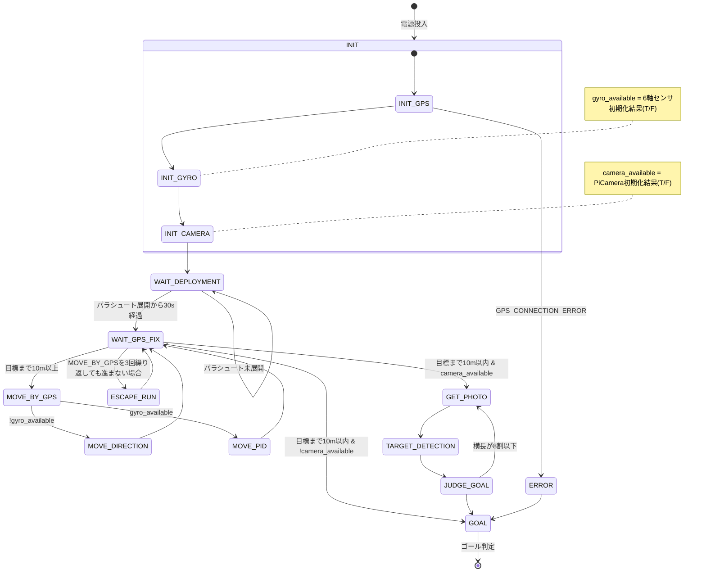

```mermaid
stateDiagram-v2
    [*] --> INIT : 電源投入
    state INIT {
        [*] --> INIT_GPS
        INIT_GPS --> INIT_GYRO
        note left of INIT_GYRO
            gyro_available = 6軸センサ初期化結果(T/F)
        end note
        INIT_GYRO --> INIT_CAMERA
        note left of INIT_CAMERA
            camera_available = PiCamera初期化結果(T/F)
        end note

    }
    INIT_GPS --> ERROR : GPS_CONNECTION_ERROR
    INIT_CAMERA --> WAIT_DEPLOYMENT
    WAIT_DEPLOYMENT --> WAIT_DEPLOYMENT : パラシュート未展開
    WAIT_DEPLOYMENT --> WAIT_GPS_FIX : パラシュート展開から30s経過
    WAIT_GPS_FIX --> MOVE_BY_GPS : 目標まで10m以上
    WAIT_GPS_FIX --> ESCAPE_RUN : MOVE_BY_GPSを3回繰り返しても進まない場合
    ESCAPE_RUN --> WAIT_GPS_FIX
    MOVE_BY_GPS --> MOVE_DIRECTION : !gyro_available
    MOVE_BY_GPS --> MOVE_PID : gyro_available
    MOVE_DIRECTION --> WAIT_GPS_FIX
    MOVE_PID --> WAIT_GPS_FIX
    WAIT_GPS_FIX --> GET_PHOTO : 目標まで10m以内 & camera_available
    WAIT_GPS_FIX --> GOAL : 目標まで10m以内 & !camera_available
    GET_PHOTO --> TARGET_DETECTION
    TARGET_DETECTION --> JUDGE_GOAL
    JUDGE_GOAL --> GET_PHOTO : 横長が8割以下
    JUDGE_GOAL --> GOAL
    GOAL --> [*] : ゴール判定
    ERROR --> GOAL
```
