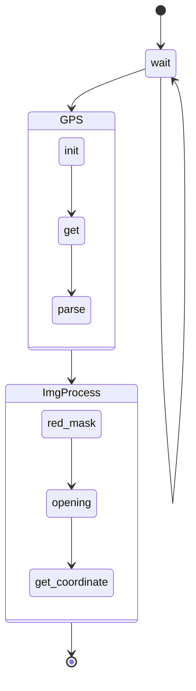

```mermaid
stateDiagram-v2
    [*] --> wait
    wait --> wait
    wait --> GPS
    GPS --> ImgProcess
    state GPS {
        init --> get
        get --> parse
    }
    state ImgProcess {
        red_mask --> opening
        opening --> get_coordinate
    }
    ImgProcess --> [*]

```